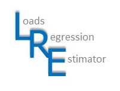

<!-- README.md is generated from README.Rmd. Please edit that file -->

```{r, echo = FALSE}
knitr::opts_chunk$set(
  collapse = TRUE,
  comment = "#>",
  fig.path = "README-"
)
```

# LRE 
## The Loads Regression Estimator


[](https://github.com/pkuhnert/LRE/actions)


## Table of contents

* [About the LRE Package](#About-the-LRE-package)
* [Package installation and vignette](#package-installation-and-vignette)
* [LRE methodology](#LRE-methodology)
* [Contribute](#contribute)
* [License](#license)
* [LRE citation](#vizumap-citation)
* [References](#references)


## About the LRE package

This tool estimates concentrations and loads (with uncertainties) using a generalised additive modelling or GAM approach. It is built heavily around the `mgcv` R package written by Simon Woods.

The authors of this package are:

 * Dr Petra Kuhnert, CSIRO Data61, Canberra, (Author and Maintainer)
   - Email: Petra.Kuhnert@data61.csiro.au

 * Dr Dan Pagendam, CSIRO Data61, Brisbane (Contributor)
 * Dr Brent Henderson, CSIRO Data61, Canberra (Contributor)

Additional contributions in terms of the method have been made by:

 * Dr Stephen Lewis (JCU, Townsville)
 * Dr Zoe Bainbridge (JCU, Brisbane)
 * Associate Professor Ryan Turner (UQ, Brisbane)
 * Dr Cassandra James (JCU, Townsville)
 * Dr Rebecca Bartley (CSIRO Environment, Brisbane)

## Package installation and vignette

You can install a development version of the LRE package from [GitHub](https://github.com/pkuhnert/LRE)

```
# install.packages("devtools")
remotes::install_github(repo = "pkuhnert/LRE", build_vignettes = TRUE, force = TRUE)
```

To explore some examples on how to use `LRE` for concentration modelling and loads estimation, please visit the pkgdown site which houses some vignettes: https://pkuhnert.github.io/LRE/.

The vignette may also be accessed within R through the following:

```
vignette("LRE")
browseVignettes(package = "LRE")
```


## LRE methodology

We have developed a statistical methodology for estimating pollutant loads with uncertainties, which has been published (Kuhnert et al. 2012). The approach is non-linear regression based and incorporates a four step process:

(1) Methods for flow regularisation to correct for sampling bias,
(2) Statistical (generalised additive) model for concentration,
(3) The load calculated at regular time intervals, and
(4) An estimate of the uncertainty in the loads estimate.

The statistical model incorporates terms for flow, and other characteristics of flow (e.g. rising or falling limb or flow history/memory), in an attempt to mimic some of the hydrological phenomena observed in these complex systems, while two different sources of uncertainties are captured by the model to address error in the concentration samples and error in the flow measurements. The regression approach is flexible and can be shown to encompass other existing load estimation methods such as the average estimators.

## Contribute
To contribute to LRE, please follow these [guidelines](CONTRIBUTING.md).

Please note that the LRE project is released with a [Contributor Code of Conduct](CONDUCT.md). By contributing to this project, you agree to abide by its terms.


## License

LRE version 1.0.0 is free under the GNU General Public License (GPL >= 3.0)

The Burdekin and Tully flow and TSS datasets have been provided by DSTIA and are provided under the Creative Commons Attribution 4.0.

Disclaimer: While the LRE package has attempted to foresee different data characteristics and applications of the underlying methodology, the use of the LRE package, or any part of it, is the sole risk of the User. 

## References

Kuhnert, P.M., Henderson, B.L., Lewis, S.E., Bainbridge, Z.T., Wilkinson, S.N. and Brodie, J.E. (2012) 
[Quantifying total suspended sediment export from the Burdekin River catchment using the loads regression estimator tool](https://agupubs.onlinelibrary.wiley.com/doi/full/10.1029/2011WR011080),
Water Resources Research, 48, W04533,doi:10.1029/2011WR011080. 

Kroon, F.J., Kuhnert, P.M., Henderson, B.L., Wilkinson, S.N., Kinsey-Henderson, A., Abbott, B., Brodie, J.E. and Turner, R.D. (2012)[River loads of suspended solids, nitrogen, phosphorus and herbicides delivered to the Great Barrier Reef Lagoon](https://www.sciencedirect.com/science/article/pii/S0025326X11005583), Marine Pollution Bulletin, 65, 4-9, 167-181.

Simpson, G. (2014)  Identifying Periods of Change with GAMS (Blog),               https://fromthebottomoftheheap.net/2014/05/15/identifying-periods-of-change-with-gams/

Woods, S.N. (2017) [Generalized Additive Models: An Introduction with R (2nd edition)](https://www.taylorfrancis.com/books/mono/10.1201/9781315370279/generalized-additive-models-simon-wood), Chapman and Hall/CRC Press. doi:10.1201/9781315370279
